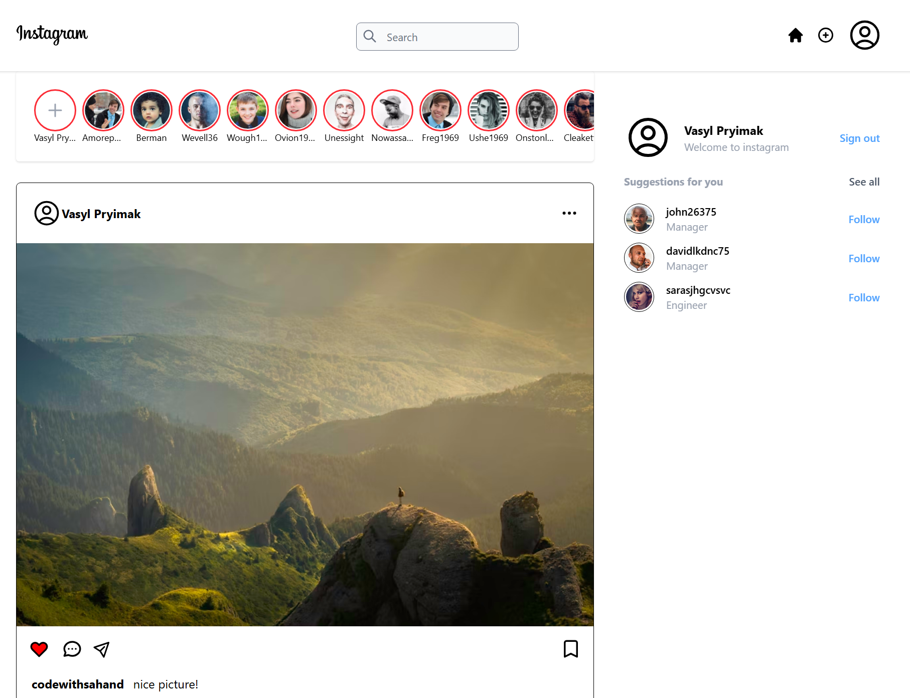

# Instagram UI clone (Tailwind CSS)

A static, educational recreation of Instagram’s main feed layout—header, stories row, post cards, and a suggestions sidebar—built with **HTML** and **Tailwind CSS v4**. It is a front-end exercise only: there is no backend, authentication, or real Instagram data.

## 🚀 Live Demo

👉 [https://tailwind-instagram-clone-psi.vercel.app/](https://tailwind-instagram-clone-psi.vercel.app/)

## Features

- **Responsive layout** — mobile-first grid that expands on `md` and `xl` breakpoints (e.g. full logo vs icon, conditional nav icons).
- **Sticky header** with search field and action icons.
- **Stories strip** with horizontal scroll and hidden scrollbars (`tailwind-scrollbar`).
- **Feed posts** — avatars, media, like/comment/share UI, captions, comment threads, and comment inputs.
- **Right column** (on larger screens) — mini profile and suggested accounts.
- **Form styling** via `@tailwindcss/forms` for inputs and focus states.
- **Icons** — inline SVGs in the markup plus [Font Awesome 6](https://cdnjs.cloudflare.com/ajax/libs/font-awesome/6.5.0/css/all.min.css) from CDN.

## Tech stack

| Piece                | Role                                         |
| -------------------- | -------------------------------------------- |
| Tailwind CSS         | Utility-first styling                        |
| `@tailwindcss/cli`   | Compiles `src/input.css` → `dist/output.css` |
| `@tailwindcss/forms` | Normalized form control styles               |
| `tailwind-scrollbar` | Scrollbar utilities (e.g. `scrollbar-none`)  |

## Getting started

### Clone the repository

```bash
git clone https://github.com/vasylpryimakdev/tailwind-instagram-clone.git
cd tailwind-instagram-clone
```

### Install dependencies

```bash
npm install
npm run build:css
```

Open `src/index.html` in the browser, or serve the project folder with any static server so asset paths resolve correctly (the stylesheet is linked as `../dist/output.css` relative to `src/`).

### Watch mode (development)

Rebuild CSS automatically when you change HTML or source CSS:

```bash
npm run watch:css
```

Keep this running in a terminal while you edit `src/index.html`, `src/input.css`, or `tailwind.config.js`.

## Project structure

```
instagram-clone/
├── dist/
│   └── output.css      # Generated — run build:css (committed for convenience)
├── src/
│   ├── index.html      # Page markup
│   └── input.css       # Tailwind entry (@import, @config, @plugin, components)
├── tailwind.config.js  # content paths + plugins
├── package.json
└── README.md
```

## Customization

- **Design tokens** — extend `theme.extend` in `tailwind.config.js`.
- **Reusable patterns** — shared component classes live under `@layer components` in `src/input.css` (e.g. `.btn`).
- **Tailwind scan paths** — `content` in `tailwind.config.js` includes `./src/**/*.{html,js,jsx,ts,tsx}` so classes in those files are included in the build.

## Scripts

| Command             | Description                                 |
| ------------------- | ------------------------------------------- |
| `npm run build:css` | One-off Tailwind build to `dist/output.css` |
| `npm run watch:css` | Watch mode for the same pipeline            |

## Screenshots

### Preview

| Home                                            |
| ----------------------------------------------- |
|  |

## Disclaimer

This project is for **learning layout and Tailwind**. Instagram is a trademark of Meta. UI assets and imagery are placeholders or publicly linked examples; this repository is not affiliated with or endorsed by Instagram or Meta.
